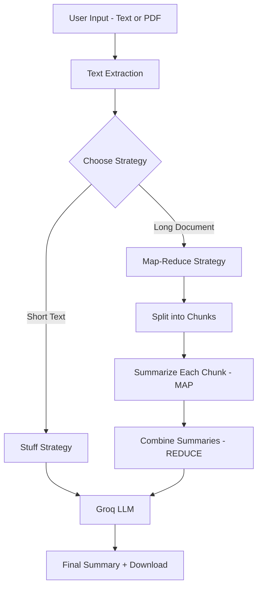

# 📝 AI Text Summarizer

> A production-deployed AI application that summarizes text and PDF documents using Large Language Models.

🚀 **Live Demo:** [vijaya-ai-summarizer.streamlit.app](https://vijaya-ai-summarizer.streamlit.app)

---

## 📌 Overview

AI Text Summarizer lets users paste text or upload PDF/TXT documents and generate intelligent summaries using LLMs. It supports two strategies — **Stuff** (fast, for short text) and **Map-Reduce** (for long documents).

---

## ✨ Features

- 📄 **PDF & TXT Upload** — Upload any document and extract text automatically
- ✍️ **Paste Text** — Directly paste any text for instant summarization
- 🔁 **Two Summarization Strategies** — Stuff and Map-Reduce
- 🎛️ **Customizable Output** — Control tone and length
- 🤖 **Multiple LLM Models** — Llama 3.1 8B, Llama 3.3 70B, Gemma 2 9B
- ⬇️ **Download Summary** — Export your summary as a text file
- 📊 **Word Count Stats** — Original vs summary word count and reduction percentage

---

## 🛠️ Tech Stack

| Technology | Purpose |
|---|---|
| **Python** | Core programming language |
| **Streamlit** | Web UI framework |
| **LangChain** | LLM orchestration framework |
| **Groq API** | Fast LLM inference (free tier) |
| **Llama 3.1 / 3.3** | Open-source LLM models |
| **PyPDF2** | PDF text extraction |
| **Streamlit Cloud** | Production deployment |

---

## 🏗️ Architecture



---

## 🚀 Getting Started

### Prerequisites
- Python 3.9+
- Groq API Key (free at [console.groq.com](https://console.groq.com))

### Installation

```bash
git clone https://github.com/vijaya-842/ai-text-summarizer.git
cd ai-text-summarizer
python -m venv venv
venv\Scripts\activate
pip install -r requirements.txt
```

### Configuration

Create a `.env` file:

```
GROQ_API_KEY=your_groq_api_key_here
```

### Run Locally

```bash
streamlit run app.py
```

---

## 📦 Requirements

```
langchain-core
langchain-text-splitters
langchain-groq
streamlit
python-dotenv
PyPDF2
```

---

## 💡 How It Works

1. User uploads a PDF or pastes text
2. Text is extracted using PyPDF2
3. Strategy selected — Stuff for short text, Map-Reduce for long documents
4. LangChain orchestrates the prompt and LLM calls
5. Groq API runs the LLM for fast inference
6. Summary returned with word count stats and download option

---

## 🌐 Deployment

Deployed on **Streamlit Cloud** with Groq API key stored securely in Streamlit Secrets.

---

## 🔮 Future Improvements

- [ ] Support for Word documents (.docx)
- [ ] Multi-language summarization
- [ ] Summarization history
- [ ] URL summarization
- [ ] Evaluation metrics (ROUGE score)

---

## 🧠 What I Learned

- How LangChain chains work (prompt → LLM → output parser)
- Difference between Stuff and Map-Reduce summarization strategies
- Using Groq API for fast, free LLM inference
- Building and deploying a production Streamlit app
- Managing API keys securely with Streamlit Secrets

---

## 👩‍💻 Author

**Vijaya Lakshmi Atluri**
- GitHub: [@vijaya-842](https://github.com/vijaya-842)
- LinkedIn: [https://www.linkedin.com/in/vijaya-atluri/]

---

⭐ If you found this project helpful, please give it a star!